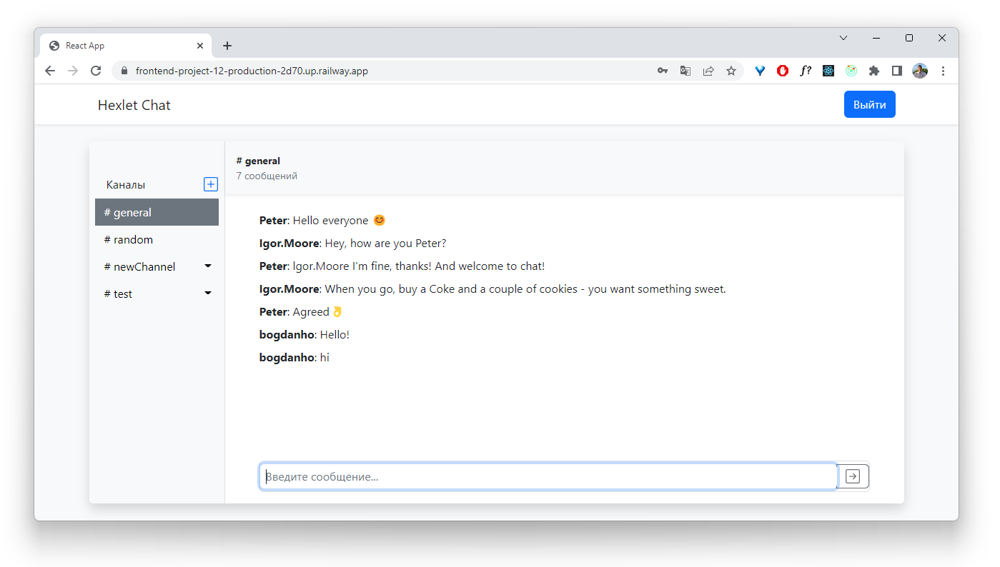
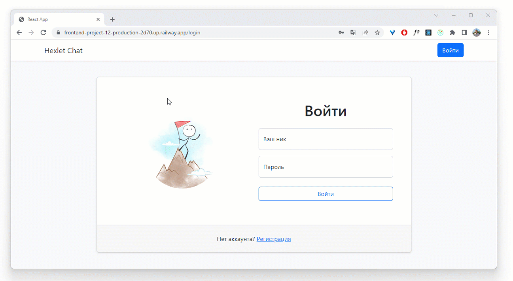

# Real-time chat app (Slack clone)

### Hexlet tests and linter status:

## About
Real-time React/Redux application using AJAX, REST, websockets, React (with hooks) + Redux (@redux/toolkit) + Formik.
#### [Link on deployed project](https://chat-app-zibj.onrender.com/)

## Getting Started
- Clone a repository
- Go to the working directory of the project `cd frontend-project-12`
- Run `make install`
- Start the server `make start`

## Features
- Real-time chatting
- Creating, editing and removing channels
- Registration and authorization of accounts
- Filtering obscene words
- Emoji support

## Demo
Check out the demo project for a quick example of how real-time chat works. 

